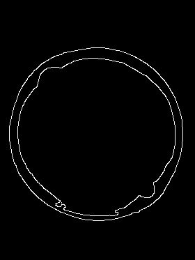

# Konkurs mierzenia pokrywki od beczki :)

Celem było wykonanie pomiaru odległości wlewów beczki od środka jej pokrywki.

1. Załadownie obrazu oryginalnego

   

   

2. Beczka jest niebieska, a tło jest beżowe, dlatego najlepiej użyć funkcji progującej kolor:

   ```python
   cv2.Range()
   ```

   

   

3. W tym momencie widać wyraźnie, że na obrazie mogą pojawić się niewielkie zakłócenia, które najlepiej usunąć przy pomocy filtracji wielkościowej, jeśli z jakiegoś powodu zakłócenia przekroczyłyby wielkość progu, to w dalszej części zostaną usunięte innymi metodami.

   Z powodu trudności w wyznaczeniu okręgów, przez bardzo duże różnice w rozmiarze, wykonano trzy różne filtracje wielkościowe.

     

   Pierwszy obraz to obwód całej pokrywy, drugi to duży otwór (dalsze algorytmy pominą pozostałe kształty) oraz ostatni to mały otwór (dzięki filtracji blob, wyrzucony zostanie kształt który nie przypomina koła

   

4. Środki całego wieka oraz większego otworu znalezione zostaną przez algorytm HoughCircles z obrazów brzegowych.

    

   Środek małego otworu, ze względu na niska rozdzielczość i nieregularny kształt łatwiej znaleźć przy pomocy wyszukania Blob, z założeniemfiltru na  poszukiwanie okrągłych blobów.

   

5. Ostateczny obraz wyjściowy z zaznaczonymi okręgami i centrami


